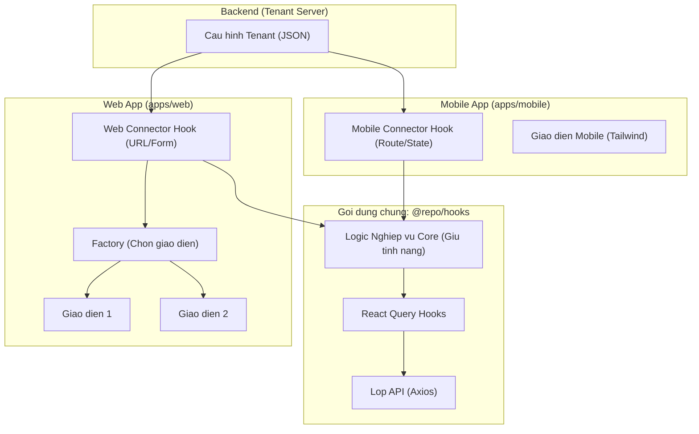

# Kiến trúc: Shared Logic Multi-Tenant Theming

Tài liệu này mô tả kiến trúc phân lớp (Layered Architecture) giúp chia sẻ logic giữa Web và Mobile, đồng thời hỗ trợ thay đổi giao diện linh hoạt theo từng Tenant.

## 1. Sơ đồ hoạt động (Activity & Data Flow)

## 2. Giải thích các lớp

### Lớp 1: Core Logic Hook (`@repo/hooks/src/pages`)
Đây là lớp quan trọng nhất để chia sẻ code.
- **Nhiệm vụ**: Gom tất cả các logic nghiệp vụ (gọi API nào, format params ra sao, logic tính toán số liệu thống kê).
- **Quy tắc**: Không được chứa bất kỳ code nào liên quan đến trình duyệt (`window`, `document`) hoặc thư viện UI (`antd`, `react-router`).
- **Input**: Nhận vào các trạng thái cơ bản (`page`, `pageSize`, `filters`).
- **Output**: Trả về dữ liệu sạch cho UI.

### Lớp 2: Connector Hook (Ứng dụng cụ thể)
Lớp này đóng vai trò "người phiên dịch" cho từng nền tảng.
- **Web**: Kết nối Core Logic với thanh địa chỉ URL (Search Params) và Form của Ant Design.
- **Mobile**: Kết nối Core Logic với Navigation của Mobile và các form native.

### Lớp 3: UI Variant (Giao diện)
Lớp này chỉ lo việc hiển thị.
- **Nhiệm vụ**: Lấy dữ liệu từ Connector Hook và render ra HTML/CSS.
- **Quy tắc**: Càng ít logic càng tốt. Nếu có logic tính toán, hãy đẩy ngược lại vào Lớp 1.

## 3. Lợi ích triển khai
1. **DRY (Don't Repeat Yourself)**: Sửa logic gọi API chỉ cần sửa 1 chỗ ở Lớp 1.
2. **Triển khai Tenant mới cực nhanh**: Chỉ cần viết thêm Lớp 3 (Giao diện mới).
3. **Đồng bộ Web/Mobile**: Đảm bảo logic filter/search giữa 2 nền tảng luôn giống hệt nhau.
